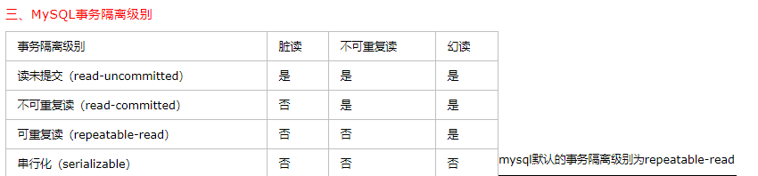

# Mysql总结

### *关系完整性

+ 实体完整性

  若属性A为关系表R的主属性，则A是不能为null的，需要唯一标识表中的记录。

+ 参照完整性

  如果一个属性A在一个表R中不是主码，但是该属性A在另一个表S中是主码，则称属性A是R的外码，R是参照关系，S是被参照关系。

+ 用户定义的完整性

  不同的关系数据库系统根据其应用环境的不同，往往还需要一些特殊的约束条件。用户定义的完成性就是针对某一具体关系数据库的约束条件，它反映某一具体应用所涉及的数据必须满足语义要求。比如说让某一非主属性列的值不能为空等等。

### *事务

+ 使用户定义的一个数据库操作序列，这些操作要么全做，要么全部做，是一个不可分割的工作单位。
+ 定义事务的语句一般由三条：
  + BEGIN TRANSACTION
  + COMMIT：提交，将事务中所有对数据库的操作的更新都写回到磁盘上的物理数据库中去，事务正常结束。
  + ROLLBACK：回滚，即在操作过程中遇到了某种故障，事务不能继续运行。

### *四大特性

+ 原子性(Atomicity)：事务所包含的一系列数据库操作要么全部成功执行，要么全部进行回滚操作。
+ 一致性(Consistency): 事物的执行结果必须使数据库从一个一致性到另一个一致性状态。
+ 隔离性(Isolation): 并发执行的事务之间不能相互影响。
+ 持久性(Durability)：事务一旦提交，对数据库中的数据的改变是永久的。

### *存储引擎

+ **InnoDB存储引擎**

  InnoDB是事务型数据库的首选引擎，支持事务安全表（ACID），支持行锁定和外键，InnoDB是默认的MySQL引擎。

+ **MyISAM存储引擎**

  MyISAM基于ISAM存储引擎，并对其进行扩展。它是在Web、数据仓储和其他应用环境下最常使用的存储引擎之一。MyISAM拥有较高的插入、查询速度，但**不支持事物**。

+ 区别：

  + 外键：MyISAM不支持外键，而InnoDB支持外键。
  + 事务支持：MyISAM强调的是性能，每次查询具有原子性，其执行数度比InnoDB类型更快，但是不提供事务支持。InnoDB提供事务、外键等高级数据库功能，具有事务提交、回滚和崩溃修复能力。
  + 表主键：MyISAM允许没有任何索引和主键的表存在，索引都是保存行的地址。对于InnoDB，如果没有设定主键或者非空唯一索引，就会自动生成一个6字节的主键(用户不可见)，数据是主索引的一部分，附加索引保存的是主索引的值。
  + InnoDB支持数据行锁定，MyISAM不支持行锁定，只支持锁定整个表。即MyISAM同一个表上的读锁和写锁是互斥的，MyISAM并发读写时如果等待队列中既有读请求又有写请求，默认写请求的优先级高，即使读请求先到，所以MyISAM不适合于有大量查询和修改并存的情况，那样查询进程会长时间阻塞。因为MyISAM是锁表，所以某项读操作比较耗时会使其他写进程饿死。

### *索引

+ 使用B+树来实现索引
+ 什么情况下设置了索引但是无法使用

  + 以“%”开头的LIKE语句，模糊匹配
  + OR语句前后没有同时使用索引
  + 数据类型出现隐式转化
+ 什么样的字段适合创建索引？

  + 经常作为查询条件的字段

  + 经常作表连接的字段

  + 经常出现在order by，group by，distinct后面的字段
+ 创建索引需要注意什么？
  + 非空字段：应该指定列为NOT NULL
  + 取离散值大的，比如说性别就不适合做索引
  + 索引字段越小越好：一次IO操作获取的数据就越多，效率就越高
+ 索引的缺点
  + 空间方面：索引需要占用物理空间
  + 时间方面：创建索引和维护索引要耗费时间，当对表的数据进行更新的时候，索引也要动态的维护。

+ 索引的分类
  + 普通索引和唯一性索引：索引列的值的唯一性
  + 单个索引和复合索引：索引列所包含的列数
  + 聚簇索引和非聚簇索引：聚集索引可以帮助把很大的范围，迅速减小范围。但是查找该记录，就要从这个小范围中Scan了；而非聚集索引是把一个很大的范围，转换成一个小的地图，然后你需要在这个小地图中找你要寻找的信息的位置，最后通过这个位置，再去找你所需要的记录。

### *Mysql的优化

##### 1,Sql语句的优化

+ 应尽量避免在where子句中使用!=或者<>操作符，否则会导致引擎放弃使用索引二进行全表扫描。
+ 应尽量避免在where子句中对字段进行null判断，否则会导致殷勤放弃使用索引而进行去全表扫描。
+ 再插入数据的时候，一次插入多组值。

##### 2，索引优化

+ 使用经常作为查询条件的字段，经常作表连接的字段，经常出现在order by，group by，distinct后面的字段。

##### 3，数据库表的优化

+ 使用较小的数据类型解决问题
+ 使用简单的数据类型
+ 尽可能地使用not null定义字段

##### 4，表的范式优化

+ 表的范式级别越高，表中数据地冗余就越低。

### *存储过程与触发器

+ 存储过程是事先经过编译并保存在数据库中地一段SQL语句的集合。
+ 存储过程只在创建的时候进行编译，以后每次执行存储过程都不需要重新编译，而一般的SQL语句执行一次就要编译一次，所以使用存储过程可以提高数据库地执行的效率。
+ 当SQL语句变动的时候，可以只修改存储过程，而不必在一处又一处的修改SQL代码。
+ 触发器始于表相关的数据库对象，在满足定义条件时触发，并执行触发器中定义的Sql语句。

### *drop，delete，truncate的区别

　SQL中的drop、delete、truncate都表示删除，但是三者有一些差别：
Delete用来删除表的全部或者一部分数据行，执行delete之后，用户需要提交(commmit)或者回滚(rollback)来执行删除或者撤销删除， delete命令会触发这个表上所有的delete触发器；
Truncate删除表中的所有数据，这个操作不能回滚，也不会触发这个表上的触发器，TRUNCATE比delete更快，占用的空间更小；
Drop命令从数据库中删除表，所有的数据行，索引和权限也会被删除，所有的DML触发器也不会被触发，这个命令也不能回滚。
因此，在不再需要一张表的时候，用drop；在想删除部分数据行时候，用delete；在保留表而删除所有数据的时候用truncate。

### *视图

+ 视图是一张虚拟的表，通常由一个表或者多个表的行或列的子集，具有和物理表相同的功能，可以对视图进行增删查改。
+ 游标的由来：在操作mysql的时候，我们知道MySQL检索操作返回一组称为结果集的行。这组返回的行都是与 SQL语句相匹配的行（零行或多行）。使用简单的 SELECT语句，例如，没有办法得到第一行、下一行或前 10行，也不存在每次一行地处理所有行的简单方法（相对于成批地处理它们）。有时，需要在检索出来的行中前进或后退一行或多行。这就是使用游标的原因。游标（cursor）是一个存储在MySQL服务器上的数据库查询，它不是一条 SELECT语句，而是被该语句检索出来的结果集。在存储了游标之后，应用程序可以根据需要滚动或浏览其中的数据。游标主要用于交互式应用，其中用户需要滚动屏幕上的数据，并对数据进行浏览或做出更改。

### *数据库的并发控制

+ 事务读数据记作R(x),写数据记作:W(x)

+ 并发带来的问题(主要原因就是并发破坏了事务的隔离性)

  - 不可重复读：是指事务T1读取数据后，事务T2执行更新操作，使T1无法再现前一次读取结果。
    - 事务T1读取某一数据后，事务T2修改了数据，当事务T1再读该数据时，得到与前一次不同的值。
    - 事务T1按一定条件从数据库中读取了某些数据记录后，事务T2删除了其中部分记录，当T1再次按相同条件读取数据的时候，发现某些记录神秘的消失了。
    - 事务T1按一定条件从数据库中读取了某些数据记录后，事务T2插入了部分记录，当T1再次按相同条件读取数据的时候，发现多了一些记录。
  - 读“脏“数据：是指事务T1修改了某一数据并将其写回了磁盘，事务T2读取同一·数据之后，T1由于某种原因进行回滚，原来写入数据库的值被撤销，那么此时T2读取的数据就与数据库中的数据不一致。
  - 幻读:是指事务非独立执行时发生的一种现象。例如事务T1对一个表中所有的数据某个数据项都从1修改成为2的操作，这时事务又对这个表插入了一行数据，而这个数据中数据项的值仍然为1，并且提交到数据库当中，当操作事务T1的用户查询刚刚修改的数据，会发现还有一行没有修改，这就发生了幻读。
  - **不可重复读的和幻读很容易混淆，不可重复读侧重于修改，幻读侧重于新增或删除。解决不可重复读的问题只需锁住满足条件的行，解决幻读需要锁表**

+ 解决办法

  + 封锁协议
    + 写锁(X):若事务T对数据对象A加上了X锁，则只允许T读取和修改数据A，其他事务不可以再对A加任何类型的锁。
    + 读锁(S):若事务T对数据对象A加上了S锁，则事务T可以读A，但是不可以修改A，其他事务只能对数据对象A加读锁，而不能加写锁。
    + 一级封锁协议：事务T在修改数据R之前必须先对其加写锁，直到事务结束后才释放.（解决了丢失修改的问题）
    + 二级封锁协议:在一级封锁协议的基础之上，增加事务T在读取数据R之前必须先对其加读锁，读完后即释放S锁。(解决了数据的脏读问题)
    + 三级锁协议:在一级锁协议的基础之上，增加事务T在读取数据R之前先对其加S锁，直到事务结束后才释放。(解决了不可重复读问题)

+ 活锁和死锁

  + 活锁：如果事务T1封锁了数据R，事务T2又请求了封锁R，于是T2等待，T3事务也请求封锁R，当T1释放了R上的封锁之后，首先批准了T3的请求，T2仍然处于等待，然后T4也来请求封锁R，结果当T3释放了R上的锁之后，首先批准了T4的请求，T2处于等待状态。以此类推，T2有可能永远处于等待状态。这就是活锁。
    + 避免活锁的简单办法就是采用先来先服务的策略。
  + 死锁:如果事务T1封锁了数据R1，T2封锁了数据R2，然后事务T1请求封锁数据R2，事务T2请求封锁事务R1。这样就形成了死锁。

### *隔离级别

+ 读未提交(可以读到未提交的内容)：例子：事务T1修改了某一数据并将其写回了磁盘，事务T2读取同一·数据之后，T1由于某种原因进行回滚，原来写入数据库的值被撤销，那么此时T2读取的数据就与数据库中的数据不一致。
+ 读提交(顾名思义就是可以读已经提交过的数据内容)：可以避免脏读。采用了快照读方式。
+ 可重复读(mysql默认的隔离级别)：和读提交不同的是，当事务启动之后就不允许进行修改操作。但是该方式不可以避免幻读，因为幻读产生的原因是由于插入或者删除一条数据而引起的。
+ 串行化：串行化顺序执行，但是效率低。
+ 总结：
  + 为什么会出现脏读：因为select 操作没有规矩。
  + 为什么会出现不可重复读：因为update操作没有规矩
  + 为什么会出现幻读：因为insert和delete操作没有规矩

### *JDBC

+ 什么是JDBC?

  + 是一种用于执行sql语句的java API，可以为多种关系数据库提供统一访问。

+ 使用JDBC的步骤

  + 加载JDBC的驱动：Class.forName("com.Mysql.jdbc.Driver");

  + 建立数据库的连接：

     Connection con = DriverManager.getConnection(url,uesr,password);

  + 创建执行sql语句的Statement

  + 处理执行结果ReaultSet

  + 释放资源

  样例

  ~~~ java
  Class.forName("com.Mysql.jdbc.Driver");
  Connection con = DriverManger.getConnection(url,user,password);  //建立连接
  String sql = "";
  PreparedStatement ps = con.preparesStatement(sql);
  
  /*处理结果集*/
  ResultSet rs = ps.executeQuery(); ->select    while(rs.next()) rs.getString("属性名")//遍历
  
  int row = ps.executeUpdate(sql)  -> insert/delete/update //更新的行数
  
  
  ~~~

