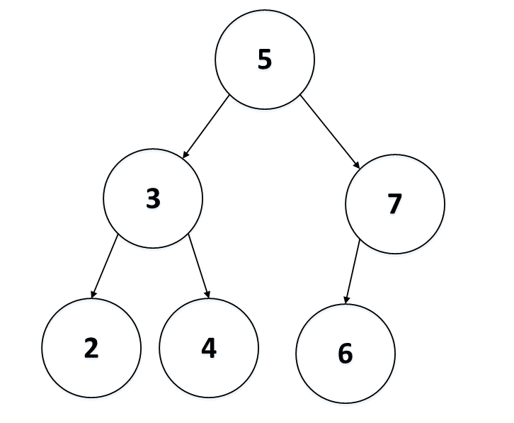
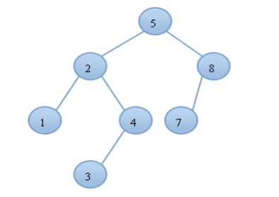
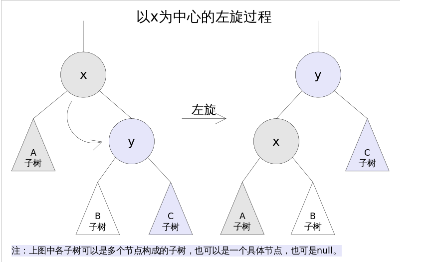
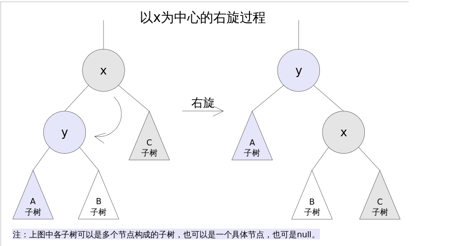
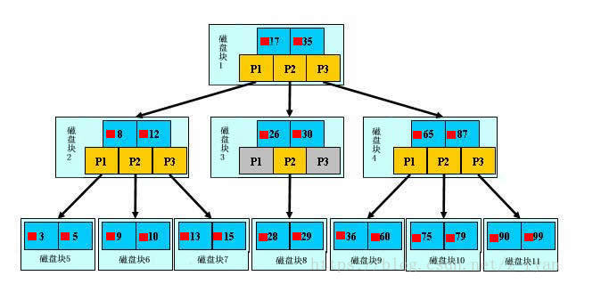
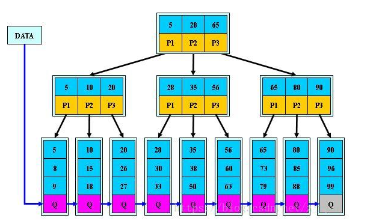

# 树总结

## 一，二叉搜索树

### 1，性质

+ 满足每个节点都满足当前左孩子节点小于当前节点，右孩子节点大于当前节点。

+ 中序遍历该二叉树是有序的，并且递增。

  

## 2，建立

~~~ java
public class CreateTree {
    public static void position(Node node, int val) {

        /**
         * 判断当前节点与要插入节点之间的关系，如果当前节点比插入节点的数值大，判断当前节点的右子树是否为空
         * 如果为空，则将要插入的数值插入到当前节点的右子节点，如果不为空，继续递归当前节点的右子节点，
         * 对于当前的节点小于要插入数字的val的话，分析过成与上述分析右子树的过程一样。
         */

        if (node.val > val) {
            if (node.left == null) {
                Node now = new Node();
                now.left = null;
                now.right = null;
                now.val = val;
                node.left = now;
                return;
            } else {
                position(node.left, val);
            }
        } else {
            if (node.right == null) {
                Node now = new Node();
                now.val = val;
                now.left = null;
                now.right = null;
                node.right = now;
                return;
            } else {
                position(node.right, val);
            }
        }
    }

    /**
     * 
     * 默认以第一个数字当作二叉搜索树的根节点
     * Createtree函数是遍历数组中的每个元素，然后调用position函数找到每个位置应当在二叉搜索树中的位置。
     */
    public static Node Createtree(int[] a, int len) {
        Node root = new Node();
        root.val = a[0];
        root.left = null;
        root.right = null;
        for (int i = 1; i < len; i++) {
            position(root, a[i]);
            // printTree(root);
        }
        return root;
    }

    /**
     * 中序遍历建立好的二叉搜索树，输出应该为升序。
     */
    public static void printTree(Node point) {
        if (point == null)
            return;
        printTree(point.left);
        System.out.println(point.val);
        printTree(point.right);
    }

    public static void main(String[] args) {
        int[] a = { 3, 5, 6, 1, 2, 4 };
        int len = a.length;
        Node root = Createtree(a, len);
        printTree(root);
    }
}

class Node {
    int val;
    Node left;
    Node right;
}
~~~

## 3，查找

~~~ java
public static boolean search(Node point,int val){
        if(point==null) return false;
        if(point.val==val){
            return true;
        } else if(point.val<val){
            return search(point.right, val);
        } else {
            return search(point.left, val);
        }
    }
~~~

## 二，AVL-平衡二叉树

参考博客：<https://www.cnblogs.com/sgatbl/p/9426394.html>

### 1，性质

+ 其本质上还是一颗二叉排序树。

+ 在二叉排序树的基础上，增加了平衡的要求，即对于任意节点来说，其左子树与右子树的高度之差的绝对值不能超过1。

+ 主要是二叉排序树它对于高度没有什么要求，在某种情况下，它会形成一条链，那么在查找的过程当中，复杂度就增加为了O(N),AVL的高度要求就避免了这种情况，它的查询复杂度为O(logN)。

  

### 2，创建

~~~ java
public class CreateAVLTree {
    public static Node position(Node point, int val) {
        if (point == null) {       //找到位置，建立节点然后插入
            point = new Node();
            point.val=val;
            point.left = null;
            point.right = null;
            point.height = 0;
            return point;
        }
        if (point.val > val) {                        //说明要插入的节点在当前节点的左子树上
            point.left = position(point.left, val);   
            if (height(point.left) - height(point.right) == 2) { //由于是在当前节点的左子树上插入节点，因此在递归返回之后，当前节点的左子树的高度一定大于当前节点右子树的高度
                if (val < point.left.val) {                      //判断类型，如果要插入的值是比当前节点的左子树的还小，那么说明当前节点插入到了当前节点的左孩子节点的左孩子节点。LL型
                    point = _LL(point);
                } else {
                    point = _LR(point);                         //同理，该类型是LR型。
                }
            }
        } else {
            point.right = position(point.right, val);
            if (height(point.right) - height(point.left) == 2) {
                if (val > point.right.val) {
                    point = _RR(point);                         //RR型
                } else {
                    point = _RL(point);                         //RL型
                }
            }
        }
        point.height = Math.max(height(point.left), height(point.right)) + 1;//计算当前节点的高度
        return point;

    }
    public static Node _LL(Node node){
        Node Newnode=node.left;
        node.left=Newnode.right;
        Newnode.right=node;
        node.height=Math.max(height(node.left), height(node.right))+1;
        Newnode.height=Math.max(height(Newnode.left),height(node.right))+1;
        return Newnode;

    }
    public static Node _RR(Node node){
        Node Newnode =node.right;
        node.right=Newnode.left;
        Newnode.left=node;
        Newnode.height=Math.max(height(Newnode.left), height(Newnode.right))+1;
        node.height=Math.max(height(node.left),height(node.right))+1;        
        return Newnode;
    }
    public static Node _LR(Node node){   //LR型先变成LL型，然后再右旋
        node.left=_RR(node.left);        
        return _LL(node);
    }
    public static Node _RL(Node node){  //RL型先变成RR型，然后再左旋
        node.right=_LL(node.right);
        return _RR(node);
    }
    public static int height(Node node) {
        return node == null ? -1 : node.height;
    }

    public static Node CreateTree(int[] a, int len) {
        Node root = new Node();
        root.height = 0;
        root.left = null;
        root.right = null;
        root.val = a[0];
        for (int i = 1; i < len; i++) {
            root=position(root, a[i]);
        }
        return root;

    }
    public static void printTree(Node point){
        if(point==null) return ;
        printTree(point.left);
        System.out.println(point.val);
        printTree(point.right);
    }
    public static void main(String[] args) {
        int[] a = { 5, 3, 4, 2, 1, 8, 6, 7, 10, 9, 11 };
        int len = a.length;
        Node root = CreateTree(a, len);
        printTree(root);
    }
}

class Node {
    int val;
    Node left;
    Node right;
    int height;
}
~~~

## 三，红黑树

主要是AVL是严格去平衡树的高度的，维护起来比较麻烦。它是一种平衡树。

### 1，性质

+ 红黑树确保没有一条路径会比其它路径长出两倍

+ 每个节点要么是红色，要么是黑色。
+ 根节点必须为黑色。
+ 红色节点的子节点一定是黑色节点。
+ 对于每个节点，到叶子节点的每条路径都包含了相同数目的黑色节点。

### 2，红黑树的一些操作

+ 左旋

  

+ 右旋

  

# 四，B树

### 1，由来

+ 在大量的数据存储中，查询时我们不能一下子将所有数据加载到内存中，只能逐一加载磁盘页，每个磁盘页对应一个树的节点。造成大量的IO操作(最坏的情况下是树的高度)，所以树的高度也能在一定程度上影响计算机运行速率。

### 2，性质

+ B树是为了磁盘或者其他设备而设计的一种平衡多路查找树，由于B树中每个节点可以分出多个分支，所以B树的高度要低于红黑树的高度。

+ 每个节点存储多个元素。

   

# 五 B+树

### 1，性质

+ 每个元素不保存数据，只是用来索引，数据都保存到叶子节点。

+ 所有的叶子节点包含了元素的全部信息。

   

### 2，与B树的比较

+ 单一节点存储更多的元素，是的查询的IO次数更少
+ 所有查询都要查找叶子节点，查询性能稳定
+ 所有叶子节点形成有序表，便于范围查询

### 3、为什么说B+tree比B树更适合实际应用中操作系统的文件索引和数据索引.　　

- B+-tree的内部节点并没有指向关键字具体信息的指针,因此其内部节点相对B树更小,如果把所有同一内部节点的关键字存放在同一盘块中,那么盘块所能容纳的关键字数量也越多,一次性读入内存的需要查找的关键字也就越多,相对IO读写次数就降低了.
- 由于非终结点并不是最终指向文件内容的结点，而只是叶子结点中关键字的索引。所以任何关键字的查找必须走一条从根结点到叶子结点的路。所有关键字查询的路径长度相同，导致每一个数据的查询效率相当。 
  ps:我在知乎上看到有人是这样说的,我感觉说的也挺有道理的: 
  他们认为数据库索引采用B+树的主要原因是:B树在提高了IO性能的同时并没有解决元素遍历的我效率低下的问题,正是为了解决这个问题,B+树应用而生.B+树只需要去遍历叶子节点就可以实现整棵树的遍历.而且在数据库中基于范围的查询是非常频繁的，而B树不支持这样的操作（或者说效率太低）.　　